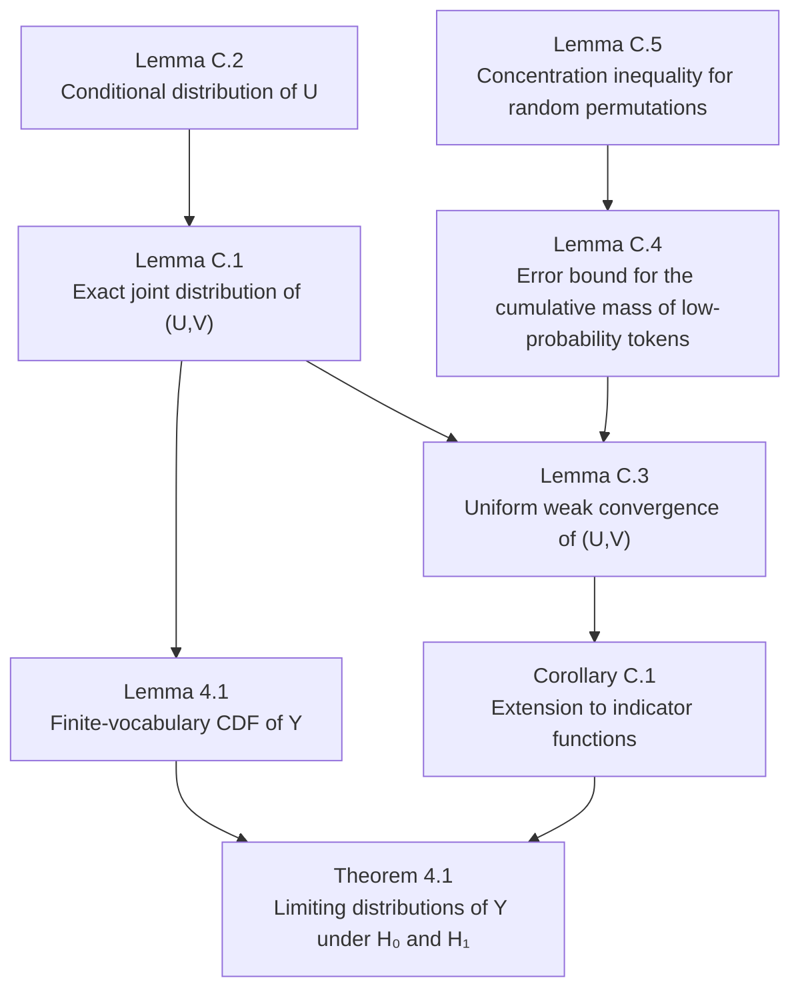
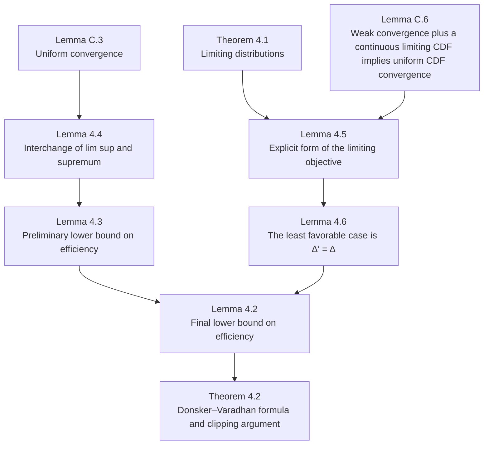

> [!remark] 
> Let $X$ be a random variable with CDF $F_X(x) = \mathbb{P}(X \le x)$. 
> Let $U \sim U(0, 1)$. 
> Let $Y = F_X^{-1}(U)$, where $F^{-1}(p) = \inf \{ x \in \mathbb{R} : F(x) \geq p \}, \quad \forall p \in [0, 1]$.
> Then $Y\sim X$.

We see "unbiasedness" there.

##### How does it work?

**Imposing an Order on the Vocabulary**

The Inverse Transform method requires a 1D real number line to define a "Cumulative" function (i.e., you must be able to say $X \le x$). 

However, the vocabulary $\mathcal{W}$ is a set of words (categorical data) with no inherent mathematical order. 

To solve this, we introduce a permutation $\pi: \mathcal{W} \to \{1, 2, \dots, |\mathcal{W}|\}$. 
- $\pi(w)$ assigns a unique integer rank to a token $w$. 
- $\pi^{-1}(i)$ takes rank $i$ and returns the corresponding token. This permutation $\pi$ allows us to arrange the discrete probabilities of the NTP distribution $\boldsymbol{P}$ into a 1D sequence on the integer line. The probability of the token at position $i$ is $P_{\pi^{-1}(i)}$.

> [!remark] 
> Why need permutation?
> Even if we use some fixed ordering, inverse transform sampling still works and the watermark is still unbiased (intuitively, only the "length" but not the position matters).
> But we need this permutation to preserve security (if use some fixed order, then $w_{t}$ and the hidden pseudorandom number $U_{t}$'s coupling relationship are static and clear.) and more importantly, validity of the pivotal quantity under $H_{0}$. 
> 

**Deriving the CDF $F(x; \pi)$**

Consider the multinomial distribution with probability mass $P_{\pi^{-1}(i)}$ at $i$ for $1\leq i\leq \lvert \mathcal{W} \rvert$.

Now that the tokens are ordered from $1$ to $|\mathcal{W}|$, we can define the CDF. The CDF $F(x; \pi)$ is the cumulative sum of probabilities for all tokens assigned a rank less than or equal to $x$.

For any real number $x$: $F(x; \pi) = \sum_{i=1}^{\lfloor x \rfloor} P_{\pi^{-1}(i)}$

To express this in terms of the original vocabulary $\mathcal{W}$ rather than the integer indices, we sum over all tokens $w' \in \mathcal{W}$, but use an indicator function $\mathbf{1}_{\{\pi(w') \le x\}}$ to only include the probabilities of tokens whose rank is less than or equal to $x$.
$F(x; \pi) = \sum_{w' \in \mathcal{W}} P_{w'} \cdot \mathbf{1}_{\{\pi(w') \le x\}}$

**Deriving the Generalized Inverse $F^{-1}(U; \pi)$**

Because the distribution is discrete, the CDF $F(x; \pi)$ is a step function. we use the generalized inverse. For a uniform random variable $U \sim U(0,1)$, $F^{-1}(U; \pi) = \min \{ i \in \mathbb{Z} : F(i; \pi) \ge U \}$

Which is $F^{-1}(U; \pi) = \min \left\{ i : \sum_{w' \in \mathcal{W}} P_{w'} \cdot \mathbf{1}_{\{\pi(w') \le i\}} \ge U \right\}$

**Deriving the Decoder $\mathcal{S}^{\text{inv}}$**

$w_t = \mathcal{S}^{\text{inv}}(\boldsymbol{P}, \zeta) := \pi^{-1}(F^{-1}(U; \pi))$ where $\zeta = (\pi, U)$ and the permutation $\pi$ is uniformly at random.

**We show this watermark is unbiased.**

We need to show $\mathbb{P}(\mathcal{S}^{\text{inv}}(\boldsymbol{P}, \zeta) = w) = P_w$ for all $w \in \mathcal{W}$.

`Proof.`
Let $w$ be an arbitrary token in $\mathcal{W}$. Let its rank under the permutation be $k = \pi(w)$. Applying $\pi$ to both sides of $\pi^{-1}(F^{-1}(U; \pi))=\mathcal{S}^{\text{inv}}(\boldsymbol{P}, \zeta) = w$, equivalently $F^{-1}(U; \pi) = \pi(w) = k$.

And so equivalently $F(k-1; \pi) < U \le F(k; \pi)$.

Since $F(k; \pi) = \sum_{w' \in \mathcal{W}} P_{w'} \cdot \mathbf{1}_{\{\pi(w') \le k\}}$ and $F(k-1; \pi) = \sum_{w' \in \mathcal{W}} P_{w'} \cdot \mathbf{1}_{\{\pi(w') < k\}}$, then equivalently $$\sum_{w' \in \mathcal{W}} P_{w'} \cdot \mathbf{1}_{\{\pi(w') < k\}} < U \le \sum_{w' \in \mathcal{W}} P_{w'} \cdot \mathbf{1}_{\{\pi(w') \le k\}}$$
The length of this interval is $F(k; \pi) - F(k-1; \pi) = P_{\pi^{-1}(k)} = P_w$.

Since $U$ is uniformly distributed on the interval $(0, 1)$, then $\mathbb{P}(\mathcal{S}^{\text{inv}}(\boldsymbol{P}, \zeta) = w)=\mathbb{P}(F(k-1; \pi) < U \le F(k; \pi)) = P_w$.

Or we can use the first remark in this document.
$\mathbb{P}(X = i) = P_{\pi^{-1}(i)}$, if $Y = F_X^{-1}(U)$, then $Y\sim X$.
$\mathbb{P}(Y = i) = \mathbb{P}(X = i) = P_{\pi^{-1}(i)}$.
Note $\mathbb{P}(\text{output } w) = \mathbb{P}(Y = \pi(w))$, thus $\mathbb{P}(Y = \pi(w)) = \mathbb{P}(X = \pi(w)) = P_{\pi^{-1}(\pi(w))} = P_w$.
`QED.`

##### Main results

By "under $H_{1}$, in contrast, a larger $U_{t}$ value suggests a larger value of $\pi_{t}(w_{t})$ in distribution for the watermarked text, which can be gleaned from (23)", it means that: recall from above, we know if say $\pi_{t}(w)=k$, then token $w$ is chosen iff $F(k-1;\pi_{t})<U_{t}\leq F(k;\pi_{t})$.  

Typo above eqaution (37). Should be $\pi(l)=w$ not $\pi(l)=k$ in the index of summation.

##### Proof of Lemma 4.1

For $H_{0}$,  From $$\mathbb{P}(Y_t^{\text{dif}} \le r \mid H_0) = \sum_{w \in \mathcal{W}} \mathbb{P}\left(U_t \in [\eta(w) - r, \eta(w) + r] \cap [0,1], \pi_t(w_t) = w \mid H_0\right)$$
Use results from lemma C.1 for $H_0$: the joint probability is $\frac{1}{|\mathcal{W}|}$ multiplied by the probability of $U_t$ falling into the target interval. Because $U_t \sim U(0,1)$, the probability of $U_t$ falling into a specific interval within $[0,1]$ is exactly the length of that interval.

For $H_{1}$, note changed order of summation and replaced probability to uniform measure. 

##### Theorem 4.1

Now we first focus on Lemma C.5

##### Lemma C.5

First we look at Bernstein’s Inequality.

> [!lemma] Bernstein’s Inequality
> Let $X_1,\ldots,X_n$ be independent random variables satisfying
> $$\mathbb E[X_i]=0, \qquad |X_i|\le M \quad\text{almost surely}$$
> for every $i$. Define
> $$S_n=\sum_{i=1}^n X_i, \qquad V=\sum_{i=1}^n\mathbb E[X_i^2] =\sum_{i=1}^n\operatorname{Var}(X_i).$$
> Then, for every $t>0$,
> $$\mathbb P(S_n\ge t) \le \exp\left( -\frac{t^2}{2(V+Mt/3)} \right)$$
> Consequently,
> $$\mathbb P(|S_n|\ge t) \le 2\exp\left( -\frac{t^2}{2(V+Mt/3)} \right)$$

`Proof.`
We will first show that, for every
$$0<\lambda<\frac{3}{M}$$
we have
$$\mathbb E[e^{\lambda X_i}] \le \exp\left( \frac{\lambda^2\mathbb E[X_i^2]} {2(1-\lambda M/3)} \right)$$

Since $X_i$ is bounded, by Fubini theorem, since
$$\sum_{k=0}^{\infty} \mathbb E\left[ \left|\frac{\lambda^kX_i^k}{k!}\right| \right] \le \sum_{k=0}^{\infty}\frac{(\lambda M)^k}{k!} =e^{\lambda M}<\infty.$$
Then
$$\mathbb E\left[ \sum_{k=0}^{\infty} \frac{\lambda^kX_i^k}{k!} \right] = \sum_{k=0}^{\infty} \mathbb E\left[ \frac{\lambda^kX_i^k}{k!} \right].$$
Therefore, by Taylor and above,
$$\begin{aligned} \mathbb E[e^{\lambda X_i}] &= \mathbb E\left[ 1+\lambda X_i+ \sum_{k=2}^{\infty}\frac{\lambda^kX_i^k}{k!} \right] \\ &= 1+\lambda\mathbb E[X_i] + \sum_{k=2}^{\infty} \frac{\lambda^k\mathbb E[X_i^k]}{k!}. \end{aligned}$$
Since $\mathbb E[X_i]=0$,
$$\mathbb E[e^{\lambda X_i}] = 1+ \sum_{k=2}^{\infty} \frac{\lambda^k\mathbb E[X_i^k]}{k!}.$$
For every integer $k\ge2$,
$$\mathbb E[X_i^k] \le \mathbb E[|X_i|^k].$$
Moreover, because $|X_i|\le M$,
$$|X_i|^k = X_i^2|X_i|^{k-2} \le X_i^2M^{k-2}$$
It follows that
$$\mathbb E[|X_i|^k] \le M^{k-2}\mathbb E[X_i^2].$$
Thus,
$$\mathbb E[e^{\lambda X_i}] \le 1+ \mathbb E[X_i^2] \sum_{k=2}^{\infty} \frac{\lambda^kM^{k-2}}{k!}$$
For every integer $k\ge2$,
$$k!\ge 2\cdot 3^{k-2}$$
This follows by induction. Equality holds for $k=2$, and if it holds for $k$, then
$$(k+1)! =(k+1)k! \ge 3\cdot 2\cdot 3^{k-2} = 2\cdot3^{k-1}$$
Using $k!\ge 2\cdot 3^{k-2}$, we obtain
$$\begin{aligned} \sum_{k=2}^{\infty} \frac{\lambda^kM^{k-2}}{k!} &\le \sum_{k=2}^{\infty} \frac{\lambda^kM^{k-2}} {2\cdot3^{k-2}}\\ &= \frac{\lambda^2}{2} \sum_{k=2}^{\infty} \left(\frac{\lambda M}{3}\right)^{k-2} \end{aligned}$$
Since $\lambda M/3<1$, the geometric series converges and
$$\sum_{k=2}^{\infty} \left(\frac{\lambda M}{3}\right)^{k-2} = \frac{1}{1-\lambda M/3}.$$
Therefore,
$$\sum_{k=2}^{\infty} \frac{\lambda^kM^{k-2}}{k!} \le \frac{\lambda^2} {2(1-\lambda M/3)}.$$
Substituting this into above gives
$$\mathbb E[e^{\lambda X_i}] \le 1+ \frac{\lambda^2\mathbb E[X_i^2]} {2(1-\lambda M/3)}.$$
Finally, using $1+u\le e^u$ for $u\ge0$, we obtain
$$\mathbb E[e^{\lambda X_i}] \le \exp\left( \frac{\lambda^2\mathbb E[X_i^2]} {2(1-\lambda M/3)} \right).$$

Next, because $X_1,\ldots,X_n$ are independent,
$$\begin{aligned} \mathbb E[e^{\lambda S_n}] &= \mathbb E\left[ e^{\lambda\sum_{i=1}^nX_i} \right]\\ &= \mathbb E\left[ \prod_{i=1}^ne^{\lambda X_i} \right]\\ &= \prod_{i=1}^n\mathbb E[e^{\lambda X_i}]. \end{aligned}$$
Applying $\mathbb E[e^{\lambda X_i}] \le \exp\left( \frac{\lambda^2\mathbb E[X_i^2]} {2(1-\lambda M/3)} \right)$ to each factor gives
$$\begin{aligned} \mathbb E[e^{\lambda S_n}] &\le \prod_{i=1}^n \exp\left( \frac{\lambda^2\mathbb E[X_i^2]} {2(1-\lambda M/3)} \right)\\ &= \exp\left( \frac{\lambda^2\sum_{i=1}^n\mathbb E[X_i^2]} {2(1-\lambda M/3)} \right). \end{aligned}$$
Since
$$V=\sum_{i=1}^n\mathbb E[X_i^2],$$
we conclude that
$$\mathbb E[e^{\lambda S_n}] \le \exp\left( \frac{\lambda^2V} {2(1-\lambda M/3)} \right)$$
for every $0<\lambda<3/M$.

Fix $t>0$. For every $0<\lambda<3/M$, the monotonicity of the exponential function and Markov’s inequality give
$$\begin{aligned} \mathbb P(S_n\ge t) &= \mathbb P(e^{\lambda S_n}\ge e^{\lambda t})\\ &\le e^{-\lambda t}\mathbb E[e^{\lambda S_n}]. \end{aligned}$$
Using $\mathbb E[e^{\lambda S_n}] \le \exp\left( \frac{\lambda^2V} {2(1-\lambda M/3)} \right)$,
$$\mathbb P(S_n\ge t) \le \exp\left( -\lambda t+ \frac{\lambda^2V} {2(1-\lambda M/3)} \right)$$
Assume first that $V>0$, and choose
$$\lambda = \frac{t}{V+Mt/3}$$
This choice is admissible because
$$\frac{\lambda M}{3} = \frac{Mt/3}{V+Mt/3} <1.$$
Let
$$D=V+\frac{Mt}{3}.$$
Then $\lambda=\frac{t}{D}$, and
$$1-\frac{\lambda M}{3} = 1-\frac{Mt/3}{D} = \frac{V}{D}.$$
Consequently,
$$\begin{aligned} -\lambda t+ \frac{\lambda^2V} {2(1-\lambda M/3)} &= -\frac{t^2}{D} + \frac{(t^2/D^2)V}{2(V/D)}\\ &= -\frac{t^2}{D} + \frac{t^2}{2D}\\ &= -\frac{t^2}{2D}. \end{aligned}$$
Substituting $D=V+Mt/3$ into $\mathbb P(S_n\ge t) \le \exp\left( -\lambda t+ \frac{\lambda^2V} {2(1-\lambda M/3)} \right)$, we obtain
$$\mathbb P(S_n\ge t) \le \exp\left( -\frac{t^2}{2(V+Mt/3)} \right).$$
If $V=0$, then
$$\sum_{i=1}^n\mathbb E[X_i^2]=0.$$
Since every term is nonnegative, $\mathbb E[X_i^2]=0$ for every $i$, which implies $X_i=0$ almost surely. Thus $S_n=0$ almost surely, and the inequality is trivial.

This proves the one-sided Bernstein inequality.

The variables $-X_1,\ldots,-X_n$ are also independent and satisfy
$$\mathbb E[-X_i]=0,\qquad |-X_i|\le M, \qquad \operatorname{Var}(-X_i)=\operatorname{Var}(X_i).$$
Applying the one-sided inequality to $-S_n$ gives
$$\mathbb P(S_n\le-t) = \mathbb P(-S_n\ge t) \le \exp\left( -\frac{t^2}{2(V+Mt/3)} \right).$$
Since event
$$\{ {|S_n|\ge t} \} = \{ {S_n\ge t}\sqcup{S_n\le-t} \}$$
then
$$\begin{aligned} \mathbb P(|S_n|\ge t) &\le \mathbb P(S_n\ge t) + \mathbb P(S_n\le-t)\\ &\le 2\exp\left( -\frac{t^2}{2(V+Mt/3)} \right). \end{aligned}$$
This completes the proof.
`QED.`

> [!remark] 
> We want to write the Bernstein inequality in the so called high-probability form.
> $$\mathbb P(|S_n|\ge t) \le 2\exp\left( -\frac{t^2}{2(V+Mt/3)} \right)\stackrel{?}{\leq}2e^{-x}$$
> It is sufficient to require
> $$\frac{t^2}{2(V+Mt/3)}\ge x$$
> Since the denominator is positive,
> $$t^2\ge 2x\left(V+\frac{Mt}{3}\right)$$
> Equivalently,
> $$t^2-\frac{2Mx}{3}t-2Vx\ge0$$
> The positive root of the corresponding quadratic equation is
> $$t_*(x) = \frac{Mx}{3} + \sqrt{ 2Vx+\frac{M^2x^2}{9} }$$
> Thus, every $t\ge t_*(x)$ satisfies the inequality. This gives the exact form
> $$\mathbb P\left( |S_n| \ge \frac{Mx}{3} + \sqrt{ 2Vx+\frac{M^2x^2}{9} } \right) \le 2e^{-x}$$
> Using $\sqrt{a+b}\le \sqrt a+\sqrt b$, we have
> $$\sqrt{ 2Vx+\frac{M^2x^2}{9} } \le \sqrt{2Vx}+\frac{Mx}{3}$$
> Therefore,
> $$t_*(x) \le \sqrt{2Vx}+\frac{2Mx}{3}$$
> Choosing the slightly larger and simpler threshold
> $$t=\sqrt{2Vx}+\frac{2Mx}{3}$$
> gives
> $$\mathbb P\left( |S_n| \ge \sqrt{2Vx}+\frac{2M}{3}x \right) \le 2e^{-x}$$

> [!remark] Lemma C.5 is the permuted version of Bernstein inequality
> Compare Bernstein to Lemma C.5, 
> $$\mathbb P\left( |S_n| \ge \sqrt{2Vx}+\frac{2M}{3}x \right) \le 2e^{-x}$$
> where $S_n=\sum_{i=1}^n X_i$.
> $$\mathbb{P}\left( \left|Z-\mathbb{E}_{\pi}Z\right| \ge 2\sqrt{ \left( \frac{1}{|\mathcal{W}|} \sum_{j,l=1}^{|\mathcal{W}|} b_{j,l}^{2} \right)x } + \sup_{1\le j,l\le|\mathcal{W}|} b_{j,l}x \right) \le 8e^{1/16}\exp\left(-\frac{x}{16}\right)$$
> where $Z=\sum_{j\in \mathcal{W}}b_{j,\overline{\pi}(j)}$, $\overline{\pi}$ a random uniform permutation in $\mathcal{W}$. 
> By random uniform permutation, it means that for every $\pi\in\Pi$，
> $$\mathbb P(\bar\pi=\pi)=\frac1{\lvert \mathcal{W} \rvert!}$$
> 
> Consequently, for a fixed $j$, $\overline{\pi}(j)$ is uniform on $\{ 1,\cdots,\mathcal{W} \}$, $i$.$e$.
> $$\mathbb P(\bar\pi(j)=l)=\frac{1}{\lvert \mathcal{W} \rvert }$$
> for $l=1,\cdots,\lvert \mathcal{W} \rvert$.
> 
> If we denote
> $$V_{\mathrm{perm}} = \frac{1}{|\mathcal{W}|} \sum_{j,l=1}^{|\mathcal{W}|} b_{j,l}^{2}=\sum_{j=1}^{n} \mathbb E_{\bar\pi}\left[b_{j,\bar\pi(j)}^2\right], \qquad M_{\mathrm{perm}} = \sup_{1\le j,l\le|\mathcal{W}|} b_{j,l}$$
> because (intuitively it is clear, as the permutation is uniform)
> $$\begin{aligned} \mathbb E_{\bar\pi} \left[b_{j,\bar\pi(j)}^2\right] &= \sum_{l=1}^{\lvert \mathcal{W} \rvert} b_{j,l}^2 \mathbb P(\bar\pi(j)=l)\\ &= \sum_{l=1}^{\lvert \mathcal{W} \rvert} b_{j,l}^2\frac{1}{\lvert \mathcal{W} \rvert}\\ &= \frac{1}{\lvert \mathcal{W} \rvert}\sum_{l=1}^{\lvert \mathcal{W} \rvert}b_{j,l}^2 \end{aligned}$$
> so
> $$\begin{aligned} \sum_{j=1}^{\lvert \mathcal{W} \rvert} \mathbb E_{\bar\pi}\left[b_{j,\bar\pi(j)}^2\right] &= \sum_{j=1}^{\lvert \mathcal{W} \rvert} \left( \frac{1}{\lvert \mathcal{W} \rvert}\sum_{l=1}^{\lvert \mathcal{W} \rvert}b_{j,l}^2 \right)\\ &= \frac{1}{\lvert \mathcal{W} \rvert}\sum_{j=1}^{\lvert \mathcal{W} \rvert}\sum_{l=1}^{\lvert \mathcal{W} \rvert}b_{j,l}^2\\ &=\frac{1}{\lvert \mathcal{W} \rvert}\sum_{j,l=1}^{\lvert \mathcal{W} \rvert}b_{j,l}^2 \end{aligned}$$
> We can see Bernstein and Lemma C.5 share the same form (if neglect constants), as
> $$V=\sum_{i=1}^n\mathbb E[X_i^2], \qquad |X_i|\le M$$
> One may ask, **why not just use Bernstein instead of Lemma C.5?**
> 
> This is because for Bernstein, it is required that $X_1,\ldots,X_n$ to be independent, which is not the case in Lemma C.5.
> 
> Denote $Y_j=b_{j,\bar\pi(j)}$. They are not independent since for example once we know $\bar\pi(1)=l$, then for any $j\neq1$, we cannot have $\bar\pi(j)=l$.

##### Lemma C.4

> [!lemma] C.4
> Define
> $$I_{\pi,w}=\mathbf{1}_{{\pi^{-1}(1)>w}} \quad\text{and}\quad A_{\bar{\pi},w} = \sum_{j=1}^{w} \left( P_{\bar{\pi}(j)}-\frac{\Delta}{|\mathcal W|-1} \right)I_{\bar{\pi},j}$$
> Then
> $$\max\left\{ \mathbb E_{\bar{\pi}} \sup_{w\in\mathcal W} I_{\bar{\pi},w} \left| a_{\bar{\pi},w}-\frac{w\Delta}{|\mathcal W|-1} \right|, \; \mathbb E_{\bar{\pi}} \sup_{w\in\mathcal W} |A_{\bar{\pi},w}| \right\} \le \sup_{\ell\in\mathcal W} \mathbb E_{\bar{\pi}} \left[ \left. \sup_{w\le \ell-1} \left| a_{\bar{\pi},w}-\frac{w\Delta}{|\mathcal W|-1} \right| \right| \bar{\pi}(\ell)=1 \right]$$
> and
> $$\sup_{\ell\in\mathcal W} \mathbb E_{\bar{\pi}} \left[ \left. \sup_{w\le \ell-1} \left| a_{\bar{\pi},w}-\frac{w\Delta}{|\mathcal W|-1} \right| \right| \bar{\pi}(\ell)=1 \right] \le \frac1{|\mathcal W|} + \sqrt{ \left(\sum_{i=2}^{|\mathcal W|}P_{(i)}^2\right) c_0\log(c_0|\mathcal W|) } + P_{(2)}c_0\log(c_0|\mathcal W|)$$
> where $P_{(i)}$ is the $i$-th largest probability in $P$ and $c_0$ is universal positive constant.

`Proof.`
The purpose of Lemma C.4 is to control the approximation error.

Note it should be $$A_{\bar{\pi},w} = \sum_{j=1}^{w} \left( P_{\bar{\pi}(j)}-\frac{\Delta}{|\mathcal W|-1} \right)I_{\bar{\pi},j}$$
instead of $A_{\bar{\pi},w} = \sum_{j\in\mathcal W} \left( P_{\bar{\pi}(j)}-\frac{\Delta}{|\mathcal W|-1} \right)I_{\bar{\pi},j}$ in the original lemma.

It is worth noting that, the proof secretly assumed (after a fixed relabeling depending only on $\boldsymbol{P}$) $$P_1=P_{(1)}=1-\Delta$$
This is WLOG and valid because any fixed relabeling depending only on $\boldsymbol{P}$ induces a bijection on the set of permutations, under which a uniform random permutation remains uniform. (The authors implicitly identify the vocabulary $\mathcal W$ with $[|\mathcal W|]$).

Note the definition of $$\overline\pi\sim U(\Pi)$$
and $\bar\pi(j)$ denotes the token on the $j$-th entry of the permutation $\bar\pi$.

Thus, 
$$I_{\overline{\pi},w}=\mathbf{1}_{{\overline{\pi}^{-1}(1)>w}}=\begin{cases} 1,&\text{if the maximum-probability token appears after position $w$ in the permutation $\overline{\pi}$}\\ 0,&\text{if the maximum-probability token appears in the first $w$ position in the permutation $\overline{\pi}$}. \end{cases}$$
and
$$A_{\bar{\pi},w} = \sum_{j=1}^{w} \left( P_{\bar{\pi}(j)}-\frac{\Delta}{|\mathcal W|-1} \right)I_{\bar{\pi},j}$$
is calculating: For a given realization of the random permutation $\bar\pi$, let $L=\bar\pi^{-1}(1)$ denote the position of the maximum-probability token, the difference between the probability mass actually accumulated up to position $\min\{ w,L-1 \}$ and the amount that would have accumulated over the same positions if the remaining probability mass $\Delta$ were evenly divided among all the other tokens. Once the maximum-probability token appears, $A_{\bar\pi,w}$ stops changing.

Now we look at what is $$\max\left\{ \mathbb E_{\bar{\pi}} \sup_{w\in\mathcal W} I_{\bar{\pi},w} \left| a_{\bar{\pi},w}-\frac{w\Delta}{|\mathcal W|-1} \right|, \; \mathbb E_{\bar{\pi}} \sup_{w\in\mathcal W} |A_{\bar{\pi},w}| \right\} \le \sup_{\ell\in\mathcal W} \mathbb E_{\bar{\pi}} \left[ \left. \sup_{w\le \ell-1} \left| a_{\bar{\pi},w}-\frac{w\Delta}{|\mathcal W|-1} \right| \right| \bar{\pi}(\ell)=1 \right]$$
where $a_{\overline{\pi},w}=\sum_{j=1}^{w}P_{\overline{\pi}(j)}$.

We see that
$$\mathbb E_{\bar{\pi}} \sup_{w\in\mathcal W} I_{\bar{\pi},w} \left| a_{\bar{\pi},w}-\frac{w\Delta}{|\mathcal W|-1} \right|$$
is the expectation, with respect to the uniformly random permutation $\bar\pi$, of the maximum absolute difference, taken over all positions before the maximum-probability token appears, between the probability accumulated up to position $w$ and what would have accumulated if the remaining probability mass $\Delta$ were evenly divided among all the other tokens.

Also note $$\mathbb E_{\bar{\pi}} \sup_{w\in\mathcal W} I_{\bar{\pi},w} \left| a_{\bar{\pi},w}-\frac{w\Delta}{|\mathcal W|-1} \right|=\mathbb E_{\bar{\pi}} \sup_{w\in\mathcal W} |A_{\bar{\pi},w}|$$
To see it, let
$$L=\bar\pi^{-1}(1),\qquad D_w=a_{\bar\pi,w}-\frac{w\Delta}{N-1}.$$
Since $L=\bar\pi^{-1}(1)$ is a function of the random permutation $\bar\pi$, $L$ **is itself a random variable**. Consequently, taking the expectation $\mathbb E_{\bar\pi}$ averages over the randomness of $L$ **as well as** the remaining randomness in $\bar\pi$.

Then
$$I_{\bar\pi,w}|D_w| = \begin{cases} |D_w|,&w<L,\\ 0,&w\ge L. \end{cases}$$
Thus
$$\sup_w I_{\bar\pi,w}|D_w| = \sup_{w<L}|D_w|.$$
Whereas
$$A_{\bar\pi,w} = \begin{cases} D_w,&w<L,\\ D_{L-1},&w\ge L. \end{cases}$$
Thus
$$\sup_w|A_{\bar\pi,w}| = \max\left\{ \sup_{w<L}|D_w|, |D_{L-1}| \right\}=\sup_{w<L}|D_w|.$$
Therefore 
$$\mathbb E_{\bar{\pi}} \sup_{w\in\mathcal W} I_{\bar{\pi},w} \left| a_{\bar{\pi},w}-\frac{w\Delta}{|\mathcal W|-1} \right|=\mathbb E_{\bar{\pi}} \sup_{w\in\mathcal W} |A_{\bar{\pi},w}|$$
as desired.

Note
$$\mathbb E_{\bar{\pi}} \sup_{w\in\mathcal W} I_{\bar{\pi},w} \left| a_{\bar{\pi},w}-\frac{w\Delta}{|\mathcal W|-1} \right|=\mathbb E_{\bar{\pi}} \sup_{w\leq L-1} \left| a_{\bar{\pi},w}-\frac{w\Delta}{|\mathcal W|-1} \right|$$
Now we look at what is 
$$\sup_{\ell\in\mathcal W} \mathbb E_{\bar{\pi}} \left[ \left. \sup_{w\le \ell-1} \left| a_{\bar{\pi},w}-\frac{w\Delta}{|\mathcal W|-1} \right| \right| \bar{\pi}(\ell)=1 \right]$$
The difference is that we fix the maximum-probability token at each position $\ell$, and we take the $\sup$ over all $\ell$ in the end. Intuitively, we are taking the worst case over all possible positions $\ell$. This is also why intuitively the inequality holds, since the LHS is averaging all positions. 

Specifically:

Recall
$$\sup_{w\in\mathcal W} I_{\bar\pi,w} \left| a_{\bar\pi,w} -\frac{w\Delta}{|\mathcal W|-1} \right| = \sup_{w\le L-1} \left| a_{\bar\pi,w} -\frac{w\Delta}{|\mathcal W|-1} \right|.$$
Since $\bar\pi\sim U(\Pi)$, then
$$\mathbb P_{\bar\pi}\bigl(\bar\pi(\ell)=1\bigr) = \frac1{|\mathcal W|}.$$
and so using tower rule,
$$\begin{aligned} & \mathbb E_{\bar\pi} \sup_{w\in\mathcal W} I_{\bar\pi,w} \left| a_{\bar\pi,w} -\frac{w\Delta}{|\mathcal W|-1} \right| \\ =& \mathbb E_{\bar\pi} \left[ \mathbb E_{\bar\pi} \left[ \left. \sup_{w\in\mathcal W} I_{\bar\pi,w} \left| a_{\bar\pi,w} -\frac{w\Delta}{|\mathcal W|-1} \right| \,\right|\, L \right] \right] \\ =& \sum_{\ell\in\mathcal W} \mathbb P_{\bar\pi}\!\left(L=\ell\right) \mathbb E_{\bar\pi} \left[ \left. \sup_{w\in\mathcal W} I_{\bar\pi,w} \left| a_{\bar\pi,w} -\frac{w\Delta}{|\mathcal W|-1} \right| \,\right|\, L=\ell \right] \\ =& \sum_{\ell\in\mathcal W} \mathbb P_{\bar\pi}\!\left(\bar\pi(\ell)=1\right) \mathbb E_{\bar\pi} \left[ \left. \sup_{w\le\ell-1} \left| a_{\bar\pi,w} -\frac{w\Delta}{|\mathcal W|-1} \right| \,\right|\, \bar\pi(\ell)=1 \right] \\ =& \frac1{|\mathcal W|} \sum_{\ell\in\mathcal W} \mathbb E_{\bar\pi} \left[ \left. \sup_{w\le\ell-1} \left| a_{\bar\pi,w} -\frac{w\Delta}{|\mathcal W|-1} \right| \right| \bar\pi(\ell)=1 \right] \\ \le& \sup_{\ell\in\mathcal W} \mathbb E_{\bar\pi} \left[ \left. \sup_{w\le\ell-1} \left| a_{\bar\pi,w} -\frac{w\Delta}{|\mathcal W|-1} \right| \right| \bar\pi(\ell)=1 \right]. \end{aligned}$$
The last inequality is due to 
$$\frac1{|\mathcal W|}\sum_{\ell\in\mathcal W}x_\ell \le \sup_{\ell\in\mathcal W}x_\ell$$

Finally we look at
$$\sup_{\ell\in\mathcal W} \mathbb E_{\bar{\pi}} \left[ \left. \sup_{w\le \ell-1} \left| a_{\bar{\pi},w}-\frac{w\Delta}{|\mathcal W|-1} \right| \right| \bar{\pi}(\ell)=1 \right] \le \frac1{|\mathcal W|} + \sqrt{ \left(\sum_{i=2}^{|\mathcal W|}P_{(i)}^2\right) c_0\log(c_0|\mathcal W|) } + P_{(2)}c_0\log(c_0|\mathcal W|)$$

We note that
$$\mathbb E_{\bar\pi} \left[ \left. a_{\bar\pi,w} \right| \bar\pi(\ell)=1 \right] = \frac{w\Delta}{|\mathcal W|-1}$$
This is because:

Fix $w\le \ell-1$, for any $j\le w$ and any $i\neq1$，we have
$$\begin{aligned} &\mathbb P_{\bar\pi} \left( \bar\pi(j)=i \mid \bar\pi(\ell)=1 \right) \\ &= \frac{ \#\{\bar\pi:\bar\pi(\ell)=1,\ \bar\pi(j)=i\} }{ \#\{\bar\pi:\bar\pi(\ell)=1\} } \\ &= \frac{(|\mathcal W|-2)!}{(|\mathcal W|-1)!} \\ &= \frac1{|\mathcal W|-1} \end{aligned}$$
Then
$$\begin{aligned} \mathbb E_{\bar\pi} \left[ \left. P_{\bar\pi(j)} \right| \bar\pi(\ell)=1 \right] &= \sum_{i=2}^{|\mathcal W|} P_i\, \mathbb P_{\bar\pi} \left( \bar\pi(j)=i \mid \bar\pi(\ell)=1 \right) \\ &= \frac1{|\mathcal W|-1} \sum_{i=2}^{|\mathcal W|}P_i \\ &= \frac{\Delta}{|\mathcal W|-1} \end{aligned}$$
Therefore
$$\begin{aligned} \mathbb E_{\bar\pi} \left[ \left. a_{\bar\pi,w} \right| \bar\pi(\ell)=1 \right] &= \mathbb E_{\bar\pi} \left[ \left. \sum_{j=1}^{w}P_{\bar\pi(j)} \right| \bar\pi(\ell)=1 \right] \\ &= \sum_{j=1}^{w} \mathbb E_{\bar\pi} \left[ \left. P_{\bar\pi(j)} \right| \bar\pi(\ell)=1 \right] \\ &= \sum_{j=1}^{w} \frac{\Delta}{|\mathcal W|-1} \\ &= \frac{w\Delta}{|\mathcal W|-1} \end{aligned}$$
and we are done.

We observe that, conditional on $\bar\pi(\ell)=1$, for each fixed $w\le \ell-1$,
$$\left| a_{\bar\pi,w} - \mathbb E_{\bar\pi} \left[ a_{\bar\pi,w}\mid\bar\pi(\ell)=1 \right] \right| = \left| a_{\bar\pi,w} - \frac{w\Delta}{|\mathcal W|-1} \right|$$
This form of "sum - its expectation" suggests that we need to use some sort of concentration inequality.

Now we need to find the "right" inequality to use.

We observe 
$$0\le P_{\bar\pi(j)}\le P_{(2)}$$
and
$$\frac{\Delta}{|\mathcal W|-1} = \frac1{|\mathcal W|-1} \sum_{i=2}^{|\mathcal W|}P_i$$
which implies
$$0\le \frac{\Delta}{|\mathcal W|-1} \le P_{(2)}$$
Combining above,
$$P_{\bar\pi(j)},\; \frac{\Delta}{|\mathcal W|-1} \in[0,P_{(2)}].$$
Since the difference between any two intergers in the interval $[0,P_{(2)}]$ is at most $P_{(2)}$,
$$\left| P_{\bar\pi(j)} -\frac{\Delta}{|\mathcal W|-1} \right| \le P_{(2)}$$
This reminds us the bounded-summand in the Bernstein inequality (**One can also think of Hoeffding, but why the paper did not use Hoeffding?**).

But this raises another problem, $P_{\bar\pi(j)}$ is not independent.

The paper found Lemma C.5 to solve this problem.

To prove the last inequality in Lemma C.4:

As in the paper, let
$$b_{j,l} = P_l\mathbf 1_{{j\le w,\ l\ne1}}$$
Condition on $\bar\pi(\ell)=1$ and under $w\le\ell-1$，
$$\begin{aligned} Z := \sum_{j\in\mathcal W}b_{j,\bar\pi(j)} &= \sum_{j\in\mathcal W} P_{\bar\pi(j)} \mathbf 1_{{j\le w,\ \bar\pi(j)\ne1}} \\ &= \sum_{j=1}^{w}P_{\bar\pi(j)} \\ &= a_{\bar\pi,w} \end{aligned}$$
If $b_{j,l}\ne0$, we must have $l\ne1$. In this case, $P_{l}\leq P_{(2)}$, so
$$\sup_{j,l}b_{j,l} \le P_{(2)}$$
We have
$$\begin{aligned} \sum_{j,l}b_{j,l}^{2} &= \sum_{j,l} P_l^2\mathbf 1_{{j\le w,\ l\ne1}} \\ &= \sum_{j=1}^{w} \sum_{l\neq1}P_l^2 \\ &= w\sum_{i=2}^{|\mathcal W|}P_{(i)}^2 \end{aligned}$$
Condition on $\bar\pi(\ell)=1$, apply Lemma C.5 to the remaining $|\mathcal W|-1$ uniform permutation (because after conditioning on $\bar\pi(\ell)=1$, $\overline{\pi}$ is no longer an uniform permutation on $\mathcal{W}$, so in this case cannot use Lemma C.5). Thus for any $x>0$,
$$\mathbb P_{\bar\pi} \left( \left. \left| a_{\bar\pi,w} -\frac{w\Delta}{|\mathcal W|-1} \right| \ge 2\sqrt{ \frac{w}{|\mathcal W|-1} \left(\sum_{i=2}^{|\mathcal W|}P_{(i)}^2\right)x } + P_{(2)}x \right| \bar\pi(\ell)=1 \right) \le  8e^{1/16}\exp\left(-\frac{x}{16}\right)$$
Given $0<\delta<1$, choose
$$x = 16\log\left(\frac{8e^{1/16}}{\delta}\right)$$
And so 
$$\delta=8e^{1/16}\exp\left(-\frac{x}{16}\right)$$
in the above inequality.

Since
$$\frac{1}{|\mathcal W|-1} \le \frac{2}{|\mathcal W|}$$
We get
$$\mathbb P_{\bar\pi} \left( \left. \left| a_{\bar\pi,w} -\frac{w\Delta}{|\mathcal W|-1} \right| \ge \sqrt{ \frac{w}{|\mathcal W|} \left(\sum_{i=2}^{|\mathcal W|}P_{(i)}^2\right)c_{0}\log\left(\frac{c_{0}}{\delta}\right) } + P_{(2)}c_{0}\log\left(\frac{c_{0}}{\delta}\right) \right| \bar\pi(\ell)=1 \right) \le \delta$$
for a suitable $c_{0}$.

Since 
$$\frac{w}{|\mathcal W|}\le1$$
We get
$$\mathbb P_{\bar\pi} \left( \left. \left| a_{\bar\pi,w} -\frac{w\Delta}{|\mathcal W|-1} \right| \ge \sqrt{ \left(\sum_{i=2}^{|\mathcal W|}P_{(i)}^2\right)c_{0}\log\left(\frac{c_{0}}{\delta}\right) } + P_{(2)}c_{0}\log\left(\frac{c_{0}}{\delta}\right) \right| \bar\pi(\ell)=1 \right) \le \delta$$
Note
$$\left\{ \sup_{w\le\ell-1} \left| a_{\bar\pi,w} -\frac{w\Delta}{|\mathcal W|-1} \right| \geq B \right\} = \bigcup_{w\le\ell-1} \left\{ \left| a_{\bar\pi,w} -\frac{w\Delta}{|\mathcal W|-1} \right| \geq B \right\},$$
where $B=\sqrt{ \left(\sum_{i=2}^{|\mathcal W|}P_{(i)}^2\right)c_{0}\log\left(\frac{c_{0}}{\delta}\right) } + P_{(2)}c_{0}\log\left(\frac{c_{0}}{\delta}\right)$.

Note for a fixed $\ell$, there exists at most $\lvert \mathcal{W} \rvert$ of $w$'s such that $w\leq \ell-1$.

Since $\mathbb P\left(\bigcup_{i=1}^m E_i\right) \le \sum_{i=1}^m\mathbb P(E_i)$ for event $E_1,\cdots,E_m$,
$$\begin{align}
&\mathbb P_{\bar{\pi}} \left( \left. \sup_{w\le \ell-1} \left| a_{\bar{\pi},w}-\frac{w\Delta}{|\mathcal W|-1} \right|\ge\sqrt{ \left(\sum_{i=2}^{|\mathcal W|}P_{(i)}^2\right)c_{0}\log\left(\frac{c_{0}}{\delta}\right) } + P_{(2)}c_{0}\log\left(\frac{c_{0}}{\delta}\right) \right| \bar{\pi}(\ell)=1 \right) \\
\leq & \sum_{w\leq \ell-1}\delta \\
=&(\ell-1)\delta \\
\leq &(\lvert \mathcal{W} \rvert -1)\delta \\
\leq &\lvert \mathcal{W} \rvert \delta
\end{align}$$
Now we choose
$$\delta=\frac{1}{|\mathcal W|^2}$$
then
$$|\mathcal W|\delta = \frac{1}{|\mathcal W|}$$
and
$$\log\frac{c_0}{\delta} = \log(c_0|\mathcal W|^2)$$
We can write $c_0\log(c_0|\mathcal W|^2)$ as 
$$c_0\log(c_0|\mathcal W|)$$
because $c_{0}$ is just a universal positive constant.

Therefore 
$$\mathbb P_{\bar\pi} \left( \left. \sup_{w\le \ell-1} \left| a_{\bar\pi,w} -\frac{w\Delta}{|\mathcal W|-1} \right| \geq \sqrt{ \left(\sum_{i=2}^{|\mathcal W|}P_{(i)}^2\right)c_0\log(c_0|\mathcal W|) } + P_{(2)}c_0\log(c_0|\mathcal W|) \right| \bar\pi(\ell)=1 \right) \leq \frac{1}{\lvert \mathcal{W} \rvert }$$
Note that condition on $\bar\pi(\ell)=1$, for all $w\le\ell-1$,
$$0\le a_{\bar\pi,w}\le\Delta$$
and
$$0\le\frac{w\Delta}{|\mathcal W|-1}\le\Delta$$
Thus 
$$0\leq\sup_{w\le\ell-1} \left| a_{\bar\pi,w} -\frac{w\Delta}{|\mathcal W|-1} \right| \le\Delta\le1$$
which follows from a similar argument above.

Denote
$$X_\ell := \sup_{w\le\ell-1} \left| a_{\bar\pi,w} -\frac{w\Delta}{|\mathcal W|-1} \right|$$
and
$$B := \sqrt{ \left(\sum_{i=2}^{|\mathcal W|}P_{(i)}^2\right) c_0\log(c_0|\mathcal W|) } + P_{(2)}c_0\log(c_0|\mathcal W|)$$
Define
$$\mathcal G_\ell:=\{X_\ell<B\}$$
and
$$\mathcal G_\ell^c=\{X_\ell\ge B\}$$
Then from before we have
$$\mathbb P_{\bar\pi}\left(\left.\mathcal G_\ell^c\right|\bar\pi(\ell)=1\right)\leq\frac1{|\mathcal W|}$$
Note
$$\mathbb E_{\bar\pi}\left[\left.X_\ell\right|\bar\pi(\ell)=1\right]=\mathbb E_{\bar\pi}\left[\left.X_\ell\mathbf1_{\mathcal G_\ell}\right|\bar\pi(\ell)=1\right]+\mathbb E_{\bar\pi}\left[\left.X_\ell\mathbf1_{\mathcal G_\ell^c}\right|\bar\pi(\ell)=1\right]$$
On $\mathcal G_\ell$, $X_\ell<B$, so
$$X_\ell\mathbf1_{\mathcal G_\ell} \le B\mathbf1_{\mathcal G_\ell}$$
Thus
$$\begin{aligned} \mathbb E_{\bar\pi} \left[ \left. X_\ell\mathbf1_{\mathcal G_\ell} \right| \bar\pi(\ell)=1 \right] &\le B\, \mathbb E_{\bar\pi} \left[ \left. \mathbf1_{\mathcal G_\ell} \right| \bar\pi(\ell)=1 \right] \\ &= B\, \mathbb P_{\bar\pi} \left( \left. \mathcal G_\ell \right| \bar\pi(\ell)=1 \right) \\ &\le B \end{aligned}$$
On $\mathcal G_\ell^c$, recall from above it is always true that $X_\ell\le1$, and so
$$X_\ell\mathbf1_{\mathcal G_\ell^c} \le \mathbf1_{\mathcal G_\ell^c}$$
Thus
$$\begin{aligned} \mathbb E_{\bar\pi} \left[ \left. X_\ell\mathbf1_{\mathcal G_\ell^c} \right| \bar\pi(\ell)=1 \right] &\le \mathbb E_{\bar\pi} \left[ \left. \mathbf1_{\mathcal G_\ell^c} \right| \bar\pi(\ell)=1 \right] \\ &= \mathbb P_{\bar\pi} \left( \left. \mathcal G_\ell^c \right| \bar\pi(\ell)=1 \right) \\ &\leq \frac1{|\mathcal W|} \end{aligned}$$
Combining above, we have 
$$\mathbb E_{\bar\pi} \left[ \left. X_\ell \right| \bar\pi(\ell)=1 \right] \leq B+\frac1{|\mathcal W|}$$
which is exactly
$$\mathbb E_{\bar{\pi}} \left[ \left. \sup_{w\le \ell-1} \left| a_{\bar{\pi},w}-\frac{w\Delta}{|\mathcal W|-1} \right| \right| \bar{\pi}(\ell)=1 \right] \le \frac1{|\mathcal W|} + \sqrt{ \left(\sum_{i=2}^{|\mathcal W|}P_{(i)}^2\right) c_0\log(c_0|\mathcal W|) } + P_{(2)}c_0\log(c_0|\mathcal W|)$$
The intuition here is that
$$0\le X\le1,\quad \mathbb P(X\geq B)\leq\varepsilon \quad\Longrightarrow\quad \mathbb E[X]\leq B+\varepsilon$$
Since this holds for all fixed $\ell$, and the RHS is free of $\ell$, we have
$$\sup_{\ell\in\mathcal W} \mathbb E_{\bar{\pi}} \left[ \left. \sup_{w\le \ell-1} \left| a_{\bar{\pi},w}-\frac{w\Delta}{|\mathcal W|-1} \right| \right| \bar{\pi}(\ell)=1 \right] \le \frac1{|\mathcal W|} + \sqrt{ \left(\sum_{i=2}^{|\mathcal W|}P_{(i)}^2\right) c_0\log(c_0|\mathcal W|) } + P_{(2)}c_0\log(c_0|\mathcal W|)$$
And we are finally done.
`QED.`

##### Lemma C.3

##### Theorem 4.2

